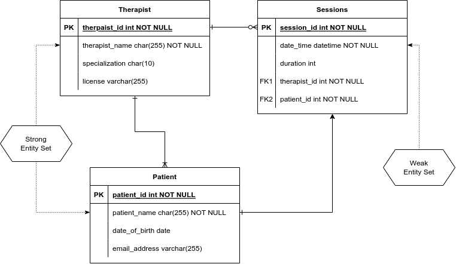
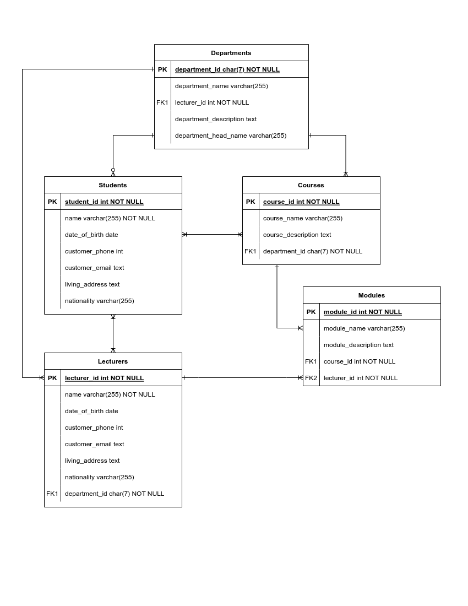
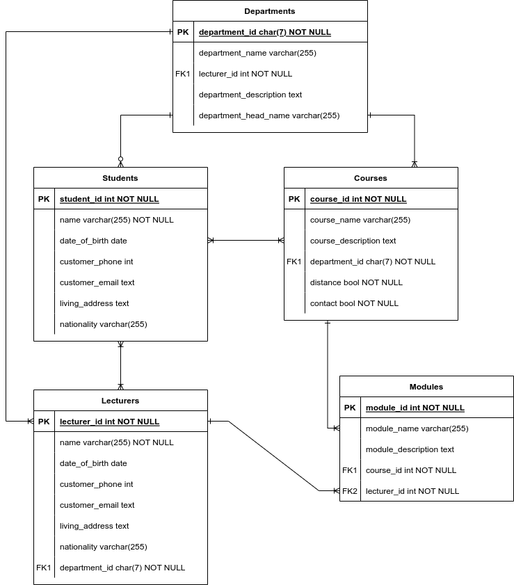
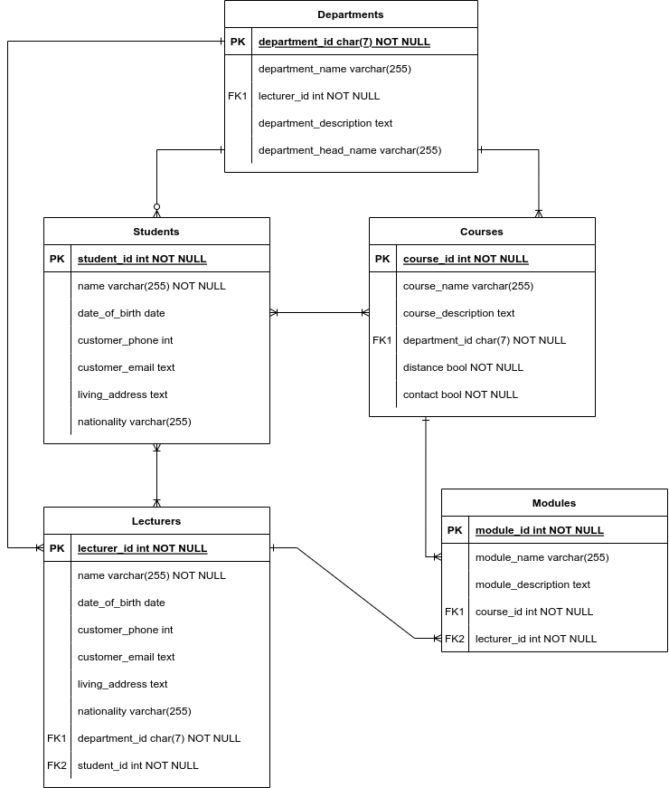

# DBS 600 - Assignment Prep

## Question 1

> 1.1 Functional dependency is a very important concept in the normalization of database tables. It is divided into, transitive dependency, partial dependency and full functional dependency. With the aid of examples, illustrate transitive dependency and fully functional dependency. **(8)**

A transitive dependency is when the value of a column can be determined by the value of another column which in turn depends on a another column. This creates a chain of dependencies. A fully-functional dependency is when a column's value is determined by every other column in the table, to have a fully-functional dependency the depenedent column can't have a a subet-set of columns that can determine it.

> 1.2 In drawing entity-relationship (ER) diagrams, an entity set can be classified as either a strong entity set or a weak entity set. Using an ER diagram example, illustrate the two. **(7)**

1. Strong-Entity set: a set that doesn't depend on other entities to exist. It is independent.
2. Weak-Entity set: a set that depends on another entity to exist.

## QUESTION 2

> 2.1 A view can be created from 1 or more database tables. If one of the tables is dropped, analyse and conclude if the view will be retained. **(4)**

A view will stop working if one of the tables it depends on is dropped. This is due to the fact that a view is a virtual table built from the underlying tables, and any changes to those tables may have an impact on the view.

The database system will produce an error indicating that the view cannot be found or that it is invalid if the view is accessed after the underlying table has been dropped. This is due to the dependence on the missing table.

The view will need to be changed or removed in order to fix this problem. The view can simply be dropped if it is no longer required.

***
> 2.2 A view can be created from 1 or more database tables. If one of the tables is dropped, analyse and conclude if the view will be retained. **(6)**

## QUESTION 3

> 3.1 From the above scenario, identify all entity sets. **(5)**

*Students entity set:* Primary-key: Student ID Attributes: Student ID, Name, Gender, Date of Birth, Contact Details (Phone Number, Email Address), Address, Nationality, Enrollment Date
*Lecturers entity set:* Primary-key: Lecturer ID - Attributes: Lecturer ID, Name, Gender, Date of Birth, Contact Details (Phone Number, Email Address), Address, Nationality, Department ID
*Courses entity set:* Primary-key: Course ID - Attributes: Course ID, Course Name, Course Description, Department ID
*Modules entity set:* Primary-key: Module ID - Attributes: Module ID, Module Name, Module Description, Course ID, Lecturer ID
*Departments entity set:* Primary-key: Department ID - Attributes: Department ID, Department Name, Department Head (Lecturer ID), Department Description

***
> 3.2 For each of the entity sets identified, suggest all possible attributes and indicate which of those attributes are primary keys. **(5)**

- Student: Attributes: Student ID ***(Primary Key)***, Name, Age, Gender, Address, Email, Phone Number, Date of Birth, Graduation Date
- Teacher: Attributes: Teacher ID ***(Primary Key)***, Name, Age, Gender, Address, Email, Phone Number, Department ID
- Courses: Attributes: Course ID ***(Primary Key)***, Course Name, Department_ID, Level, Credits
- Modules: Attributes: Module ID ***(Primary Key)***, Module Name, Course ID, Teacher ID, Description, Start Date, End Date
- Departments: Attributes: Department ID ***(Primary Key)***, Department Name, Location, Head of Department

***
> 3.3 Draw an ER diagram for the above scenario. **(10)**

***
> 3.4 Given that each student that enrolls for a course is either a contact student or a distance learning student, extend your ER diagram to illustrate specialization and generalization concepts. **(6)**

***
> 3.5 Given that some of the lecturers are also students in the same institution, extend your ER diagram to show this overlapping constraint. **(4)**

***
> 4.1 Identify the update and deletion anomalies in the above relation. ***(5)***
***
> 4.2 Normalise the above relation up to Boyce Codd Normal Form (BCNF). For each of the normal forms, state the conditions and explain if the relation(s) meet the requirements for that normal form. Write down all the relations, indicating primary keys for each of them. ***(20)***
>
> Hint: the following functional dependencies exist:
>
> Emp_No → Emp_Name, Emp_Add
>
> Dept_No → Dept_Name, Dept_Location
>
> Dept_Name → Dept_Location

1. **1st Normal Form (1NF)**

- Eliminate repeating groups
- Identify the primary key
- Identify All Dependencies

***Primary Key*** (composite key) - designation, emp_no, dept_no

**Employees Table - Attributes:**

- Designation
- Emp_No
- Emp_Name
- Emp_Add
- Dept_No
- Dept_Name
- Dept_Location

*Dependencies:*

emp_no -> emp_name, emp_add

dept_no -> dept_name -> dept_location <!-- transitive dependency -->

dept_no -> designation

2. **2nd Normal Form (2NF)**

- Make new tables to eliminate partial dependencies
- Reassign matching dependent attributes

Make 2 tables. An employee table and department table.

**Employees Table - Attributes:**

- Emp_No (**PK**)
- Emp_Name
- Emp_Add

**Department Table - Attributes:**

- Dept_No (**PK**)
- Dept_Name
- Dept_Location
- Designation

The relations meet the criteria for 2nd-normal form. There are no partial dependencies

3. **3rd Normal Form (3NF)**

- Make new tables to eliminate transitive dependencies
- Reassign matching dependent attributes

**Employees Table - Attributes:**

- Emp_No (**PK**)
- Emp_Name
- Emp_Add

**Department Table - Attributes:**

- Dept_No (**PK**)
- Dept_Name
- Dept_Location
- Designation

The relations meet the criteria for 3rd-normal form, there are no transitive dependencies

4. **Boyce Codd Normal Form (BCNF)**

- All keys must be candidate keys

**Employees Table - Attributes:**

- Emp_No (**PK**)
- Emp_Name
- Emp_Add

**Department Table - Attributes:**

- Dept_No (**PK**)
- Dept_Name
- Dept_Location
- Designation

Does not meet the BCNF as every key is not a candidate key

***
> 4.3 Most library systems in the world use the Dewey Decimal System for the organization and classification of books and journal papers. Briefly explain, how this system works. ***(3)***

The Dewey Decimal System works by breaking books into different categories with numeric.
***
> 4.4 Which type of database is ideal for implementing these systems. Justify your choice? ***(5)***
Relational Database

A relational database organizes data by breaking it up into attributes. The Dewey Decimal system uses a system of categorization with lends itself to the paradigm of an RDBS. A RDBS can store each level of the Dewey Decimal system as a different table.

There are ten main subject areas: The system is divided into ten main subject areas, each represented by a specific numerical range:

000-099: General Knowledge and Information
100-199: Philosophy and Psychology
200-299: Religion
300-399: Social Sciences
400-499: Language
500-599: Natural Sciences and Mathematics
600-699: Technology and Applied Sciences
700-799: Arts and Recreation
800-899: Literature
900-999: History, Geography, and Biography
***
> 4.5 What is the main weakness of the type of database that you have chosen above? ***(2)***
A RDBS expects to deal with structured data. Semi-Strutcured or Unstructed data is unsuited to being managed by a relational database. A RDBS requires the definer to know before hand what tables to create and how they relate. This makes a RDBS inflexible.
***

References:

- [Normalisation](https://www.youtube.com/watch?v=J-drts33N8g)
